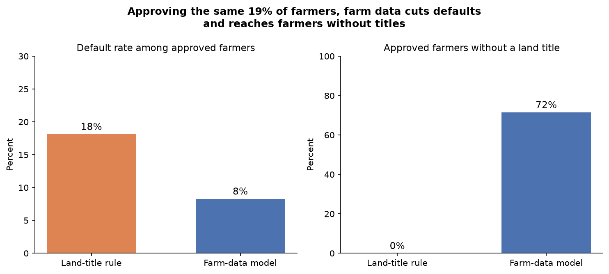
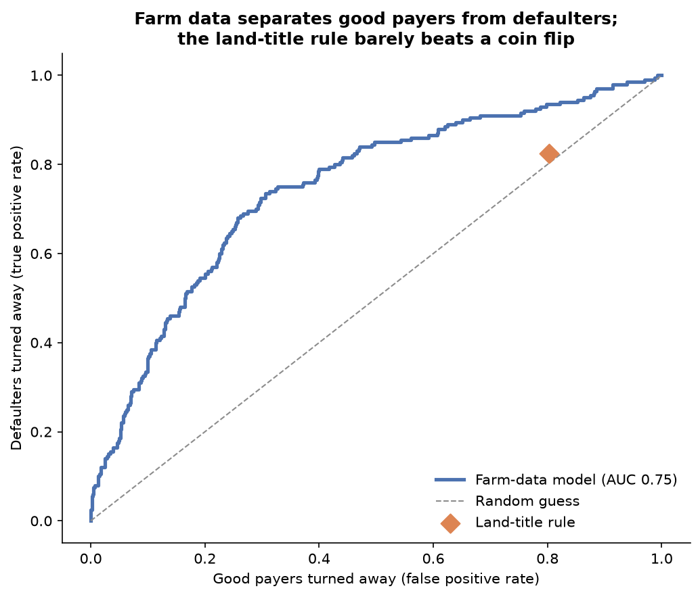
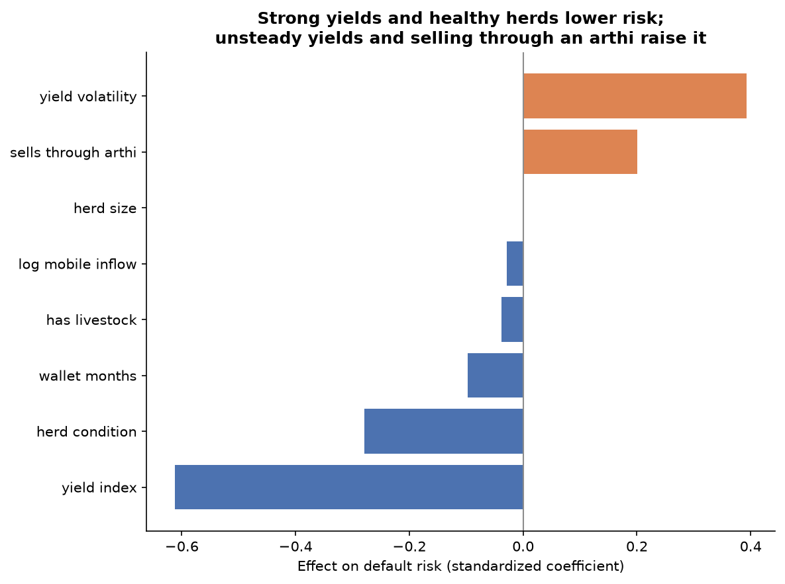

# CreditMate

**Scoring smallholder farmers on what their farms produce, not on the land they own.**

A prototype credit-scoring pipeline for farmers in Sindh, Pakistan, many of whom are shut out of formal credit because lenders ask for land titles as collateral. CreditMate scores farmers on farm data instead: yields and how steady they are, herd health, mobile-wallet history, and whether they depend on an arthi (commission agent) for cash.

> **All data in this repository is simulated.** No real farmer or repayment data is used. The simulation encodes CreditMate's core assumption, so the results show the pipeline works end to end, not that farm data predicts repayment in the real world. That test needs real lender data.

## Results on 1,000 simulated test farmers

The model was trained on 3,000 farmers, its approval cutoff was set on another 1,000, and every figure below comes from 1,000 farmers it never saw.

| Decision rule | Farmers approved | Default rate among approved | Approved with no land title |
|---|---|---|---|
| Land-title rule (titled farms of 5+ acres) | 19% | 18% | 0% |
| Farm-data model, same approval rate | 19% | 8% | 72% |
| Farm-data model, 10% target default rate | 57% | 9% | 70% |

- The farm-data model ranks farmers well (AUC 0.75); the land-title rule does barely better than chance.
- Approving the same number of farmers, it more than halves defaults, and most of the farmers it approves have no title.
- Keeping defaults under 10%, it approves three times as many farmers as the land-title rule.





## How it works

1. **Simulate** (`creditmate/simulate.py`): 5,000 farmers with land, titles, crops, irrigation, three-season yields, herd size and condition, mobile-wallet activity, arthi dependence, and whether they defaulted within 12 months.
2. **Build features** (`creditmate/model.py`): the model sees yields, yield volatility, herd data, wallet history and inflows, and arthi dependence. Land size and titles are left out on purpose.
3. **Train** a logistic regression, chosen because each factor's effect can be read and explained to a lender or a regulator.
4. **Set the cutoff** on the validation farmers so that at most 10% of approved farmers default.
5. **Score and offer** (`creditmate/scorecard.py`): probabilities become scores from 300 to 850, where 600 means 20 farmers repay for every one who defaults and each 40 points doubles those odds. Approved farmers get an offer of up to 35% of expected seasonal income, structured as Murabaha (the lender buys seed and fertilizer and sells them to the farmer at an agreed markup, repaid after harvest) or Ijarah (a solar pump lease for farms on diesel pumps or rain). The structures are illustrative and would need a Shariah board's approval.



## Run it

```bash
pip install -r requirements.txt
python run_pipeline.py      # simulate, train and test; writes data/ and outputs/
python -m pytest            # five checks on the pipeline
jupyter notebook notebooks/creditmate_walkthrough.ipynb
```

## Repository

```
creditmate/
  simulate.py     synthetic farmer population
  model.py        features, training, comparison with the land-title rule
  scorecard.py    scores and Murabaha / Ijarah offers
  charts.py       the figures in outputs/
notebooks/        step-by-step walkthrough
outputs/          metrics.json, charts, sample_decisions.csv
data/             farmers_simulated.csv
tests/            pytest checks
run_pipeline.py   end-to-end run
```

## Limits

- The data is simulated, as above.
- Collateral does a different job: land lets a lender recover losses after a default. This prototype only models who is likely to default.
- One model on one simulated population, with no fairness, stability or calibration checks yet.

## Next steps

- Train and test on real repayment records from a lender or microfinance bank.
- Score livestock body condition from a phone photo with a computer-vision model.
- Estimate yields from satellite imagery and public crop and irrigation records.
- Check approvals for fairness across districts, crops and farm sizes.
- Work with regulators on how alternative farm data can count as a valid credit input.

## Author

Saad Shahzad Qureshi. Released under the MIT License.
